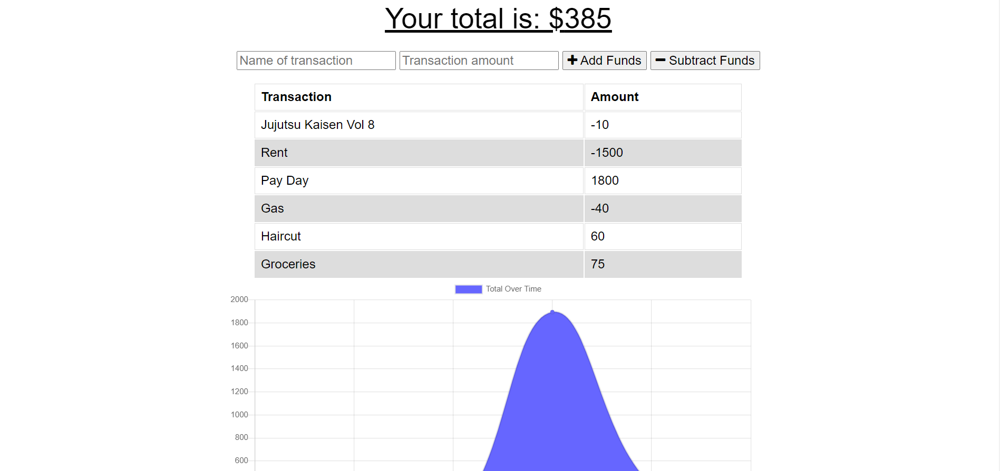

# Budget-Tracker

- The purpose of the budget tracker is to be able to add or subtract funds to to their budget whether they are online or offline! While offline, user's can still add or subtract funds. Once those user's get back online, all of the expenses they either added or subtracted are added to the tracker.

## Installation

- Run npm install in your terminal to launch this useful budget tracker!

```bash
node i express
node i mongoose
node i morgan
node i compression
node i lite-server
```

## Usage

- While on the home page, you can add and subtract expenses and a graph will populate at the bottom of the page tracking your expenses.
  

## License

- Built under the MIT licence.

## Test

- No tests required.
